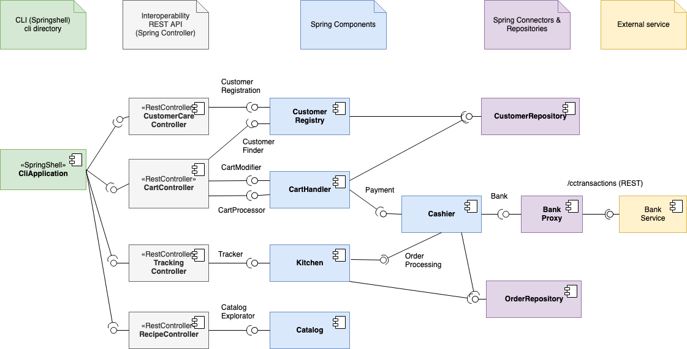
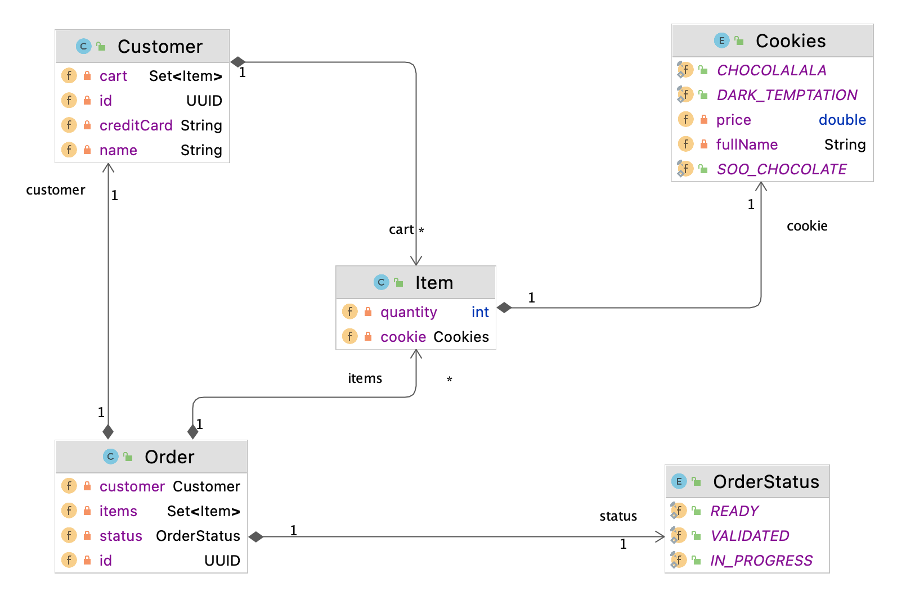

# Architecture

  * Author: Philippe Collet

## Components assembly

The system is defined as layers:

  * A remote client (green), that will run on each customer's device (simulated here by a command line interface);
  * A Spring kernel (blue), implementing the business logic of the CoD system;
  * An interoperability layer (grey) between the client and the kernel, implemented as REST Controllers in Spring (in the same backend project as the blue components);
  * A connector and repositories layer (purple) between the components and the data provider, connectors are for external partners, repositories are for uniform data access;
  * An external partner (orange), communicating with the CoD system through a REST API as well.

  

## Functional interfaces

To deliver the expected features, the coD system defines the following interfaces:

  * `CartModifier`: operation to modify a given customer's cart, by updating the number of cookies in it, 
  * `CartProcessor`: operations for retrieving the contents of the cart and validating the cart to process the associated order;
  * `CustomerFinder`: a _finder_ interface to retrieve a customer based on her identifier (here simplified to her name);
  * `CustomerRegistration`: operations to handle customer's registration (users profile, ...)
  * `CatalogueExploration`: operations to retrieve recipes available for purchase in the CoD;
  * `OrderProcessing`: process an order (kitchen order lifecycle management);
  * `Payment`: operations related to the payment of a given cart's contents;
  * `Tracker`: order tracker to retrieve information about the current status of a given order.
  * `Bank`: operations that act as proxies to the external bank service.

## Business objects

The business objects are simple:

  

